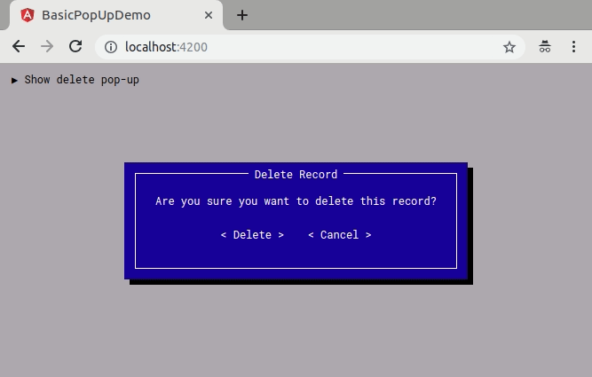

# Demo project for creating pop-ups in Angular

This the source code for a project I wrote on Medium about creating pop-ups in Angular without the aid of 3rd party libraries.

## Usage

Use the `app-pop-up` component tag to show enclosed content in a pop-up window. Open and close the pop-up window using the `isOpen` boolean input value.

## Demo

Here is a sample pop-up I created with `app-pop-up`:

